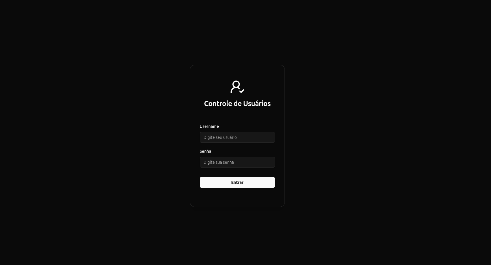
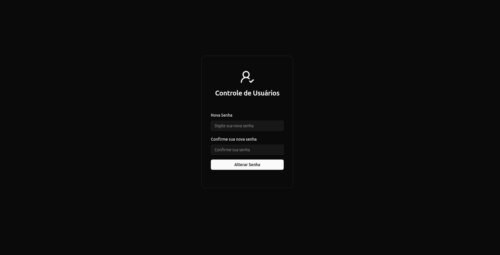
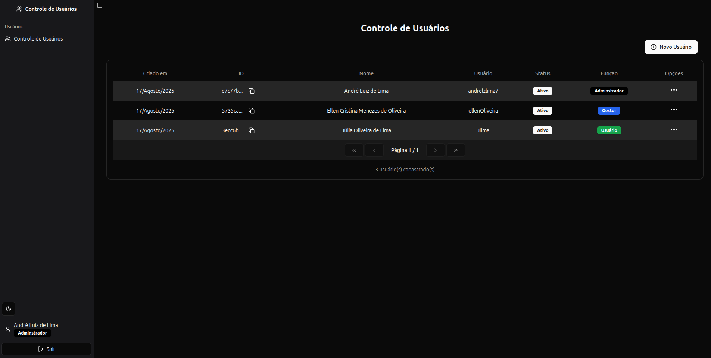

# 📌 Login page and user control

Este projeto implementa um fluxo completo de autenticação de usuários, incluindo login, redefinição de senha no primeiro acesso e controle de permissões. Foi desenvolvido com o objetivo de estudo e prática em boas práticas de autenticação, segurança e gerenciamento de usuários em aplicações web modernas.

---

## 🚀 Tecnologias Utilizadas

- [Next.js](https://nextjs.org/)
- [React](https://react.dev/)
- [TypeScript](https://www.typescriptlang.org/)
- [Prisma ORM](https://www.prisma.io/)
- [PostgreSql](https://www.postgresql.org/)
- [TailwindCSS](https://tailwindcss.com/)
- [Shadcn/UI](https://ui.shadcn.com/)

---

## 🛠️ Conceitos e Tecnologias Utilizadas

Middleware: utilizado como interceptador para proteger rotas privadas, garantindo que apenas usuários autenticados tenham acesso.

Cookies no servidor: responsáveis por armazenar e recuperar informações de sessão do usuário de forma segura.

Server Actions (Next.js 14): todas as chamadas ao banco de dados são feitas através de Server Actions, garantindo melhor performance e segurança ao manter a lógica no servidor.

Prisma ORM: utilizado para comunicação com o banco de dados PostgreSQL (rodando localmente em ambiente de desenvolvimento). O Prisma fornece tipagem forte, migrações automáticas e abstração das queries SQL.

Criptografia de senhas: senhas dos usuários são armazenadas de forma criptografada no banco, seguindo boas práticas de segurança.

Zod: biblioteca usada para validação de dados (inputs de formulários, schemas de autenticação e usuários).

TailwindCSS + Shadcn/UI: para estilização, com foco em componentes reutilizáveis e consistência visual.

Arquitetura modular: cada fluxo da aplicação (ex.: autenticação, redefinição de senha, controle de usuários) está organizado em módulos separados dentro da pasta app, com seus próprios schemas, server actions e componentes.

## 📂 Estrutura do Projeto

- ┣ 📂 prisma
- ┣ 📂 src
- ┃ ┣ 📂 app
- ┃ ┃ ┣ 📂 (auth)
- ┃ ┃ ┃ ┣ 📂 \_auth-schema
- ┃ ┃ ┃ ┣ 📂 \_server-actions
- ┃ ┃ ┃ ┣ 📂 components
- ┃ ┃ ┃ ┗ 📜 page.tsx
- ┃ ┃ ┣ 📂 reset-password
- ┃ ┃ ┃ ┣ 📂 \_password-schema
- ┃ ┃ ┃ ┣ 📂 \_server-actions
- ┃ ┃ ┃ ┣ 📂 components
- ┃ ┃ ┃ ┗ 📜 page.tsx
- ┃ ┃ ┣ 📂 users-control
- ┃ ┃ ┃ ┣ 📂 \_server-actions
- ┃ ┃ ┃ ┣ 📂 \_user-schema
- ┃ ┃ ┃ ┣ 📂 components
- ┃ ┃ ┃ ┗ 📜 page.tsx
- ┃ ┃ ┣ 📂 fonts
- ┃ ┃ ┣ 📜 favicon.ico
- ┃ ┃ ┣ 📜 globals.css
- ┃ ┃ ┗ 📜 layout.tsx
- ┃ ┣ 📂 components
- ┃ ┃ ┣ 📂 global
- ┃ ┃ ┣ 📂 layout
- ┃ ┃ ┣ 📂 theme
- ┃ ┃ ┗ 📂 ui
- ┃ ┣ 📂 hooks
- ┃ ┣ 📂 lib
- ┃ ┗ 📂 utils
- ┣ 📜 middleware.ts
- ┣ 📜 .env
- ┣ 📜 .eslintrc.json
- ┣ 📜 .gitignore
- ┣ 📜 .prettierrc
- ┣ 📜 components.json
- ┣ 📜 next-env.d.ts
- ┣ 📜 next.config.mjs
- ┣ 📜 package-lock.json
- ┗ 📜 package.json

## 🏗️ Arquitetura da Aplicação

A aplicação foi desenvolvida seguindo uma arquitetura modular, com foco em segurança, escalabilidade e boas práticas.  
Abaixo está o fluxo principal da autenticação e controle de usuários:

### 🔐 Fluxo de Autenticação

1. **Acesso a rota privada**
   - O usuário tenta acessar uma rota protegida.
   - O **middleware** intercepta a requisição e verifica a presença do **cookie de sessão**.
   - Caso não exista sessão válida, o usuário é redirecionado para a tela de login.

2. **Login**
   - O usuário informa **usuário e senha**.
   - Uma **Server Action** valida as credenciais no banco de dados via **Prisma ORM**.
   - Em caso de sucesso, um **cookie seguro** é criado no servidor para manter a sessão.

   <p align="center">
     
   </p>

3. **Primeiro acesso**
   - Caso o usuário esteja com status `pendente`, ele é redirecionado para a tela de **reset de senha**.
   - O fluxo exige a criação de uma nova senha, que é armazenada de forma **criptografada** no banco.
   - Após redefinir a senha, o status muda para `ativo` e o usuário é redirecionado ao **controle de usuários**.

   <p align="center">
     
   </p>

4. **Sessão ativa**
   - Com sessão válida, o usuário acessa a aplicação normalmente.
   - O middleware continua validando o cookie a cada requisição para garantir segurança.

   <p align="center">
     
   </p>

---

### 🗄️ Camada de Persistência

- **Prisma ORM**: abstrai queries SQL para o banco **PostgreSQL**.
- **Migrations automáticas**: permitem versionar alterações no banco.
- **Senha criptografada**: nunca é salva em texto puro, garantindo confidencialidade.

---

### 📑 Validações

- **Zod** é usado para garantir que os dados enviados pelos usuários (login, senha, cadastro) estejam no formato correto antes de qualquer interação com o banco de dados.

---

### 🎨 Interface e Estilização

- **TailwindCSS**: estilização responsiva e utilitária.
- **Shadcn/UI**: componentes reutilizáveis e acessíveis.
- **Arquitetura modular**: cada fluxo (`auth`, `reset-password`, `users-control`) possui seus próprios **schemas, server actions e componentes** dentro da pasta `app`.

---

### ⚙️ Resumo do Fluxo

Usuário → Middleware → Login → Cookie de Sessão → Reset de Senha (se pendente) → Controle de Usuários

## 💻 Como Rodar o Projeto

Siga os passos abaixo para clonar o repositório, instalar as dependências e iniciar a aplicação localmente:

### Clonar o repositório

```bash
git clone https://github.com/andrelzlima7/login-page-and-user-control.git
```

### Instalar dependências

```bash
npm install
```

### Configurar variáveis de ambiente

```bash
DATABASE_URL=
JWT_SECRET=
```

### Rodar migrações e gerar Prisma Client

```bash
npx prisma migrate dev
npx prisma generate
```

### Adicione o primeiro usuário através da interface do prisma

```bash
npx prisma studio

Lembres-se de gerar a senha criptografada para o primeiro usuário.
```

### Rodar a aplicação

```bash
npm run dev

A aplicação estará disponível em http://localhost:3000
```

## ✅ Conclusão

Este projeto demonstra um fluxo completo de autenticação e controle de usuários utilizando Next.js, Prisma, TailwindCSS e Shadcn/UI. Ele serve como referência para boas práticas em:

- Segurança e criptografia de senhas
- Controle de acesso via middleware
- Estrutura modular e escalável
- Validações de dados com Zod
- Integração com banco PostgreSQL via Prisma ORM

Sinta-se à vontade para clonar, estudar, modificar ou expandir a aplicação de acordo com suas necessidades.

---

### 📬 Contato

Se tiver dúvidas ou sugestões, entre em contato:

- **E-mail:** andrelzlima7@gmail.com
- **LinkedIn:** [André Luiz de Lima](https://www.linkedin.com/in/andr%C3%A9-luiz-de-lima-66958319b/)

Obrigado por conferir a documentação! 🚀
